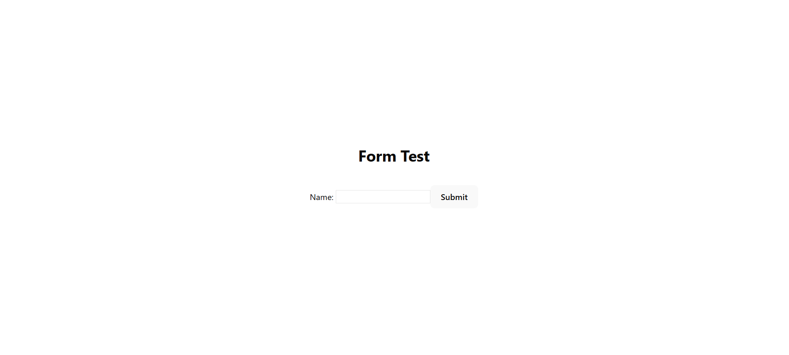
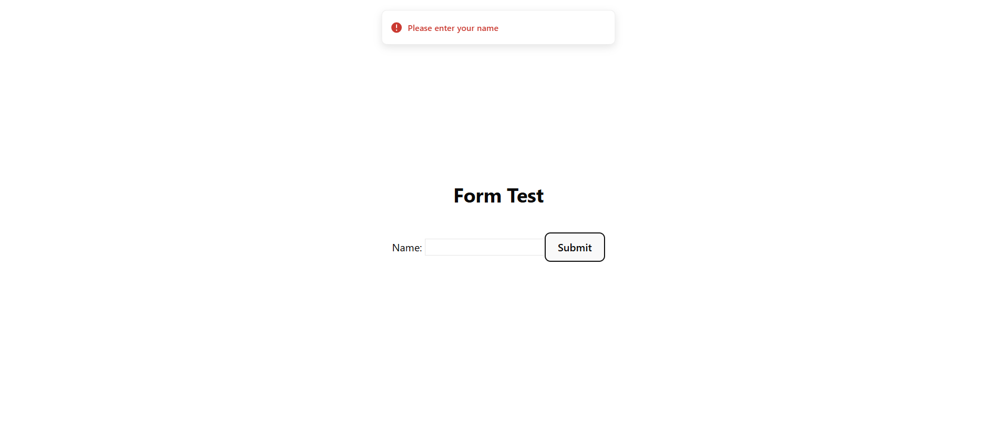
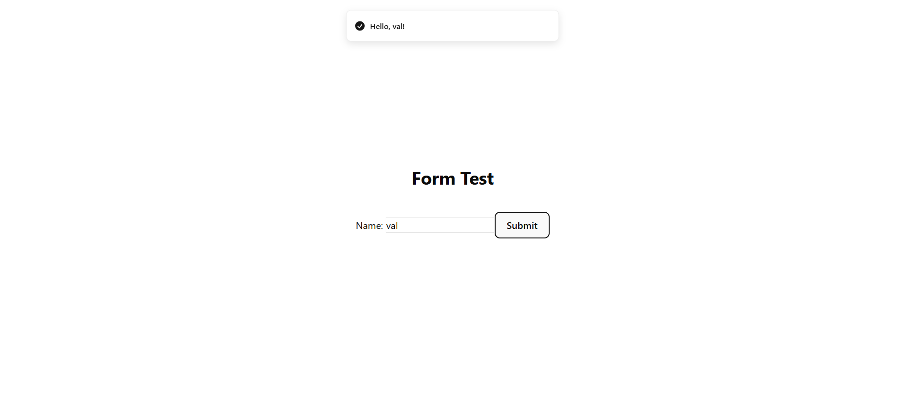
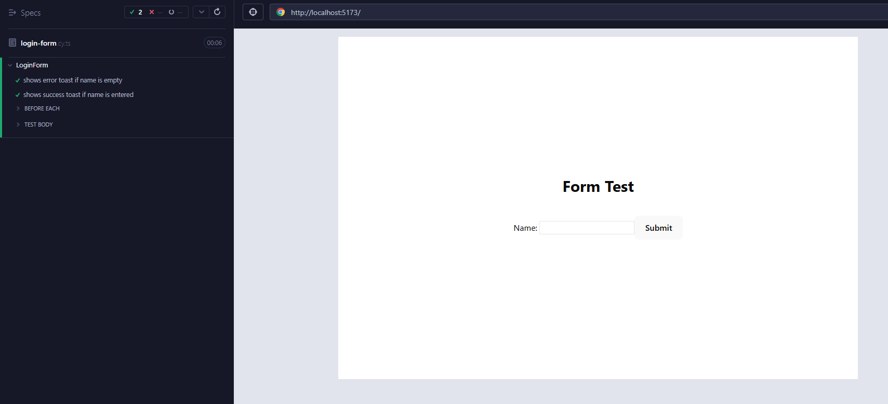

# React Cypress Login Form

A minimal **React + Vite + TypeScript** project with **Cypress E2E tests**.  
Demonstrates form validation and toast notifications using `sonner`.

---

## 📸 Screenshots

<p>
  
  
</p>
<p>
  
  
</p>

---

## 🛠 Tech Stack

- **React 19**, **Vite 7**, **TypeScript 5**
- **Cypress 14** – E2E testing
- **Sonner** – Toast notifications
- **Tailwind CSS** – Layout utilities

---

## ✅ Test Scenarios

1. **Empty form submission** → shows error toast: _"Please enter your name"_
2. **Valid form submission** → shows success toast: _"Hello, {name}!"_

---

## 🚀 Getting Started

```bash
# Clone repository
git clone https://github.com/your-username/frontend-qa-testing-examples.git

# Move into this project folder
cd react-cypress-login

# Install dependencies
npm install

# Run the app
npm run dev

# Run Cypress tests
npx cypress open
```
